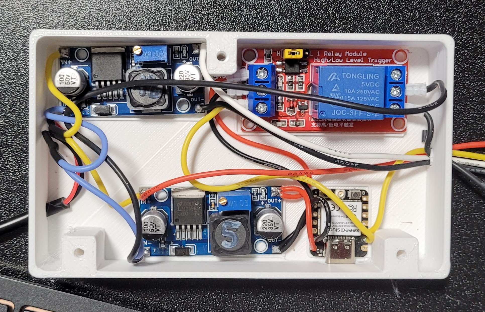

# GrowTower

A minimalist, vertical grow tower designed for home cannabis cultivation. This project focuses on space efficiency, ease of use, and effective odor control, making it perfect for beginners and small living spaces.

## Features

- **Vertical Grow System:** Maximizes vertical space usage.
- **Integrated Odor Control:** Features a custom-designed activated carbon filter housing.
- **Silent & Efficient Cooling:**  Uses a standard Arctic P14 generic PC fan for both airflow and cooling.
- **Web-based Control:** Control your GrowTower from any browser at `http://growtower.local` - no app required!
- **Automatic Light Timer:** Configurable 24h light schedule with web interface.
- **Minimalist Design:** clean aesthetics that blend into a modern home environment.
- **Beginner Friendly:**  Simple assembly and maintenance. Hard to make mistakes.
- **3D Printable:**  Most structural components are designed to be 3D printed.
- **Odor-Free Drying:** Convert the tower into a drying chamber after harvest using the included Dryer Module, utilizing the carbon filter.

## Gallery

| | | |
|:---:|:---:|:---:|
|  |  |  |
| *Front View* | *With Light Chamber* | *Inside* |

### Controller & Electronics

*Wired ESP32 Controller with Fan, Light Relay and Power Supply*

## How it Works

The GrowTower utilizes a forced-air system where the Arctic P14 fan pulls air through the tower, ensuring fresh CO2 for the plant and maintaining optimal temperatures. The air is then pushed through an activated carbon filter before exiting, neutralizing any odors. The vertical stacking design allows for modularity and easy height adjustment as the plant grows.

## Semi-Hydroponic Growing System

The GrowTower operates as a **semi-hydroponic system** using a drip irrigation method. Water is delivered directly to the plant's root zone through a drip system, providing precise moisture control while maintaining some of the benefits of traditional soil growing.

### Recommended Growing Medium

For optimal results and to prevent root rot in this semi-hydroponic setup, we highly recommend:

- **Composana Qualitätsblumenerde** mixed with **40% Perlite**
- This 1:1 mixture ensures excellent drainage and aeration
- The high perlite content prevents waterlogging and root rot, which is crucial when working with a drip system
- Avoid using regular potting soil without amendments, as it retains too much moisture

## Drying after Harvest

With the included **Dryer Module** (STL), the GrowTower can easily be converted into an odor-free drying chamber. The module is simply inserted between the top Inner Shell and the Filter Housing. You can hang and tie your harvested plant directly to this module. The active carbon filter ensures that the entire drying process remains completely odorless.

## Getting Started

See [BOM.md](BOM.md) for a full list of materials required to build your own GrowTower.

## Web Controller

The GrowTower includes a built-in web server for easy control via WiFi:

- **Access:** Open `http://growtower.local` in any browser after connecting to WiFi
- **Features:**
  - Real-time status dashboard (light, fan, timer)
  - Manual light control (ON/OFF)
  - PWM fan speed adjustment (0-100%) with configurable min/max range
  - 24-hour light timer with automatic scheduling
  - Configurable device hostname (e.g., `mytower.local`)
  - REST API for custom integrations

### Quick Start

1. Flash the ESP32 with the firmware from the `firmware/` directory
2. Configure WiFi credentials in `firmware/.env` (see [firmware/README.md](firmware/README.md))
3. Connect to power - the device will automatically connect to WiFi
4. Open `http://growtower.local` in your browser
5. Control your GrowTower from anywhere on your network!

For detailed firmware documentation, see [firmware/README.md](firmware/README.md).

## 3D Printing Instructions

All STL files and detailed printing instructions are located in the [`stls/`](stls/) directory. This includes material recommendations, slicer settings, and assembly instructions.

For detailed printing instructions including material recommendations, light-proofing steps, and slicer settings for the Plant Pot, Internal Sieve, and Reservoir, please see [`stls/README.md`](stls/README.md).

## Current Experiments

1. **Stress Killer CBD (Automatic):**
   - Currently testing with an automatic strain.
   - *Note:* While autoflowers can be counterproductive in restricted spaces due to lack of control over size/timing, this run serves primarily as a system stress test.
   - **Results so far:** The wick system with no-name soil (without perlite) created too much moisture at the roots, which blocked nutrient uptake. The leaves are very yellow, and although the plant is flowering, it shouldn't be this harsh already. 
   - **The Good:** The buds are beautiful—large and dense!
   - **The Not-So-Good:** The lower part of the plant is bushy, which hopefully won't happen with the One-Bud method.
   - **Expected Harvest:** Beginning of March 2026 (if it survives that long).
   - **Lesson learned:** The wick system with regular soil without perlite was the problem. Too much moisture at the roots blocks nutrient uptake. If using the water reservoir, only add as much water as you would normally water with, OR mix in 50% perlite with the soil to maintain the reservoir feature without creating a swamp.

## Grow #2 - One-Bud Method with Improved Setup

For the second grow, I will implement the One-Bud technique with an improved setup based on lessons learned from the first grow and forum feedback.

### Technique

- **Strain:** Purple Bud (Feminized Photoperiod)
- **Approach:** Completely skip the vegetative phase. Both plants will be placed directly into the flowering light cycle (12/12) immediately after germination
- **Goal:** Produce a single main cola (One-Bud). This minimizes lateral growth, saves significant space, and reduces the total cultivation time. The GrowTower's vertical design is exceptionally well-suited for this technique.

### Setup Changes for Grow #2

- **Growing Medium:** Composana Qualitätsblumenerde mixed with **40-50% Perlite**

- **Fertilizer:** Use **mineral Compo Blüte** fertilizer 

### Parallel Experiment: Two Towers Comparison

For Grow #2, I will run **two GrowTowers simultaneously** with Purple Bud (Photoperiod) to compare two different watering setups:

| Tower A | Tower B |
|---------|---------|
| Composana + 50% Perlite | **LECA** (Expanded Clay) + Wick |
| Bottom watering only | Water reservoir with wick system |
| Purple Bud | Purple Bud |

**Tower A (No Wick):**
- Classic bottom watering approach
- Direct control over water/nutrient delivery
- No risk of overwatering from reservoir

**Tower B (With Wick + LECA):**
- Bottom section (feet): Completely filled with LECA, no soil
- Wick embedded in the LECA layer for passive water transport
- Tests if LECA + wick provides the right moisture balance
- LECA ensures excellent drainage and aeration around the roots

This comparison will help determine which method works best for the GrowTower semi-hydroponic setup. 

### Fertilizer Schedule (Micro-Grow)

**Week 1 - Week 3 (Germination to first white pistils):**
- Pure water only - no fertilizer
- The nutrients in the 50% Compo Sana soil are sufficient
- The plant will grow large and green on soil nutrients alone

**Week 3/4 onwards (Flowering begins):**
- Start adding **Compo Blüte** to the water (bottom watering)
- Start with **25-50% of the recommended dose** - the soil still has residual nutrients
- Only increase if the plant shows signs of hunger (light green/yellowing)

**Last 10-14 days before harvest:**
- Pure water only (flushing)
- Allows the plant to use up remaining nutrient salts from the leaves

### Critical Watering Warning

**NEVER water from above later in the grow!**

When bottom watering with mineral fertilizer, water moves up through the soil and evaporates at the surface. The fertilizer salts accumulate in the top soil layer (often visible as white crust).

If you suddenly water from above, you flush these highly concentrated salts directly down into the roots - causing immediate, fatal nutrient shock.

**Always water from below throughout the entire grow.**

### pH Management

- Use proper pH-down products (e.g., Canna pH- Bloom)
- Avoid pH-down with citric acid for pH correction
- Target pH range: 6.0-6.3

