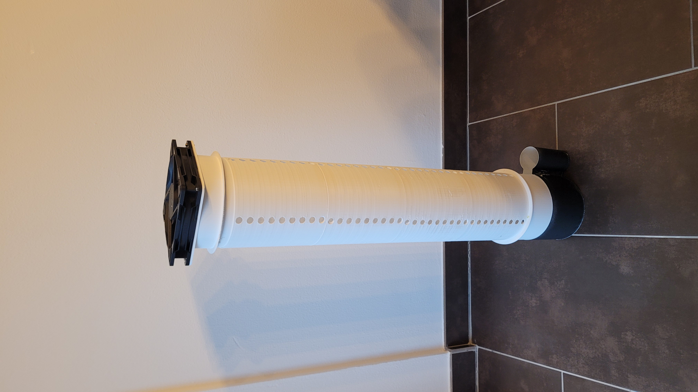
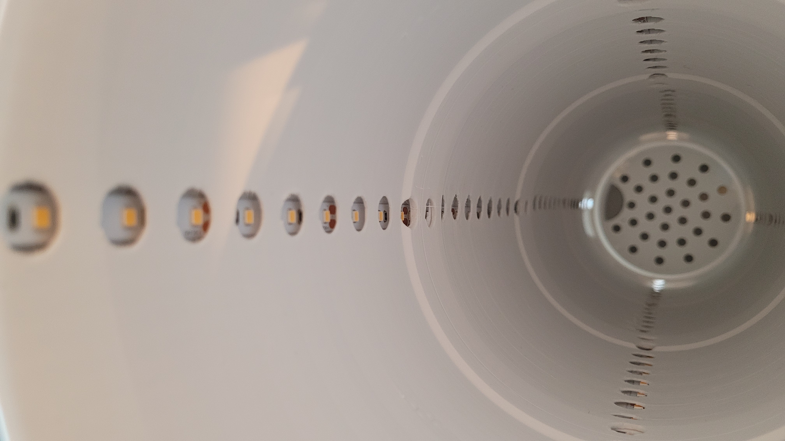

# GrowTower

A minimalist, vertical grow tower designed for home cannabis cultivation. This project focuses on space efficiency, ease of use, and effective odor control, making it perfect for beginners and small living spaces.

## Features

- **Vertical Grow System:** Maximizes vertical space usage.
- **Integrated Odor Control:** Features a custom-designed activated carbon filter housing.
- **Silent & Efficient Cooling:**  Uses a standard Arctic P14 generic PC fan for both airflow and cooling.
- **Web-based Control:** Control your GrowTower from any browser at `http://growtower.local` - no app required!
- **Automatic Light Timer:** Configurable 24h light schedule with web interface.
- **Minimalist Design:** clean aesthetics that blend into a modern home environment.
- **Beginner Friendly:**  Simple assembly and maintenance. Hard to make mistakes.
- **3D Printable:**  Most structural components are designed to be 3D printed.

## Gallery

| | | |
|:---:|:---:|:---:|
|  |  |  |
| *Front View* | *With Light Chamber* | *Inside* |

## How it Works

The GrowTower utilizes a forced-air system where the Arctic P14 fan pulls air through the tower, ensuring fresh CO2 for the plant and maintaining optimal temperatures. The air is then pushed through an activated carbon filter before exiting, neutralizing any odors. The vertical stacking design allows for modularity and easy height adjustment as the plant grows.

## Getting Started

See [BOM.md](BOM.md) for a full list of materials required to build your own GrowTower.

## Web Controller

The GrowTower includes a built-in web server for easy control via WiFi:

- **Access:** Open `http://growtower.local` in any browser after connecting to WiFi
- **Features:**
  - Real-time status dashboard (light, fan, timer)
  - Manual light control (ON/OFF)
  - PWM fan speed adjustment (0-100%) with configurable min/max range
  - 24-hour light timer with automatic scheduling
  - Configurable device hostname (e.g., `mytower.local`)
  - REST API for custom integrations

### Quick Start

1. Flash the ESP32 with the firmware from the `firmware/` directory
2. Configure WiFi credentials in `firmware/.env` (see [firmware/README.md](firmware/README.md))
3. Connect to power - the device will automatically connect to WiFi
4. Open `http://growtower.local` in your browser
5. Control your GrowTower from anywhere on your network!

For detailed firmware documentation, see [firmware/README.md](firmware/README.md).

## Internal Sieve Printing Instructions

The Internal Sieve model is intentionally designed to be "closed". To print it correctly:

1.  **Open the Sieve:** In your slicer, use a modifier to remove the top and bottom solid layers.
2.  **Create the Mesh:** Set the infill density to approximately **30%** and use a **Rectilinear** pattern. This generates the necessary mesh structure for the filter.

| | |
|:---:|:---:|
|  |  |

## Current Experiments

1. **Stress Killer CBD (Automatic):**
   - Currently testing with an automatic strain.
   - *Note:* While autoflowers can be counterproductive in restricted spaces due to lack of control over size/timing, this run serves primarily as a system stress test.

2. **One-Bud Method (Future Plan):**
   - **Strain Type:** Feminized seed (Photoperiod), NOT Automatic.
   - **Technique:** Completely skip the vegetative phase. The plant will be placed directly into the flowering light cycle immediately after germination.
   - **Goal:** To produce a single main cola (One-Bud). This minimizes lateral growth, saves significant space, and reduces the total cultivation time. The GrowTower's vertical design is exceptionally well-suited for this technique.

