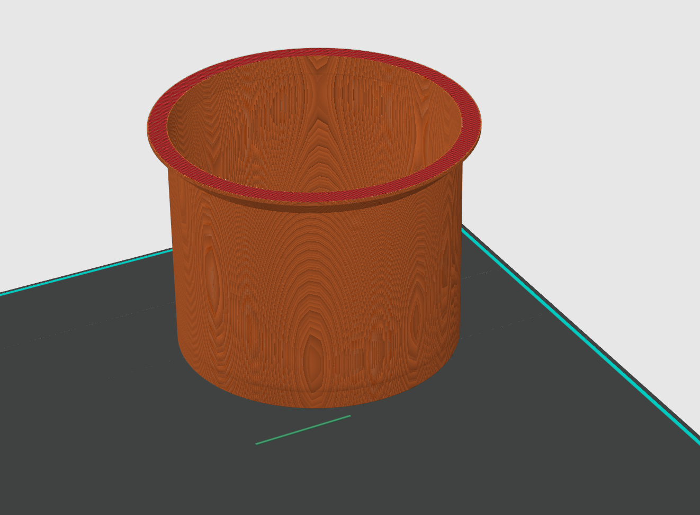
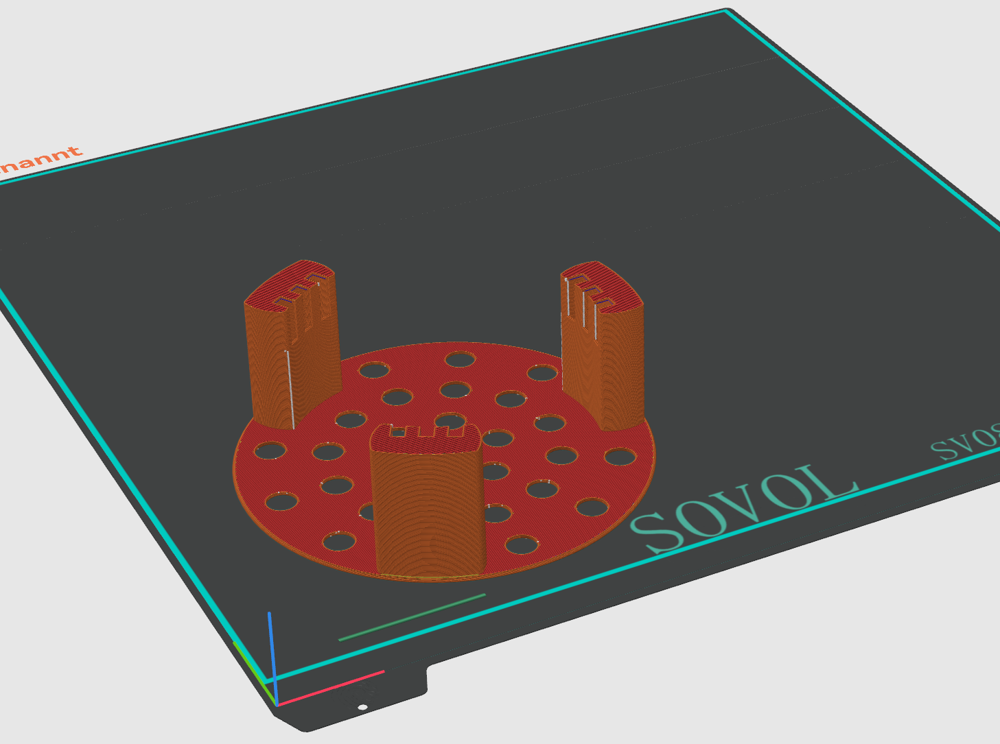
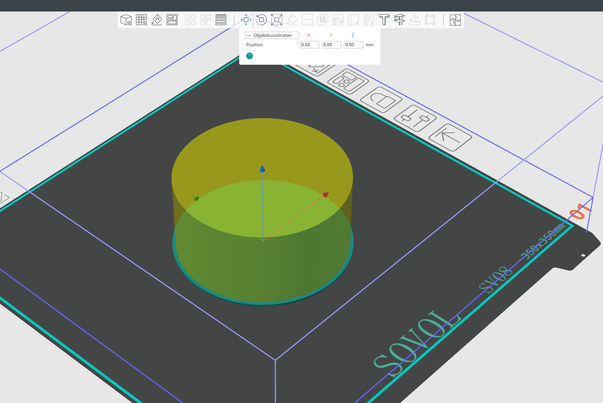
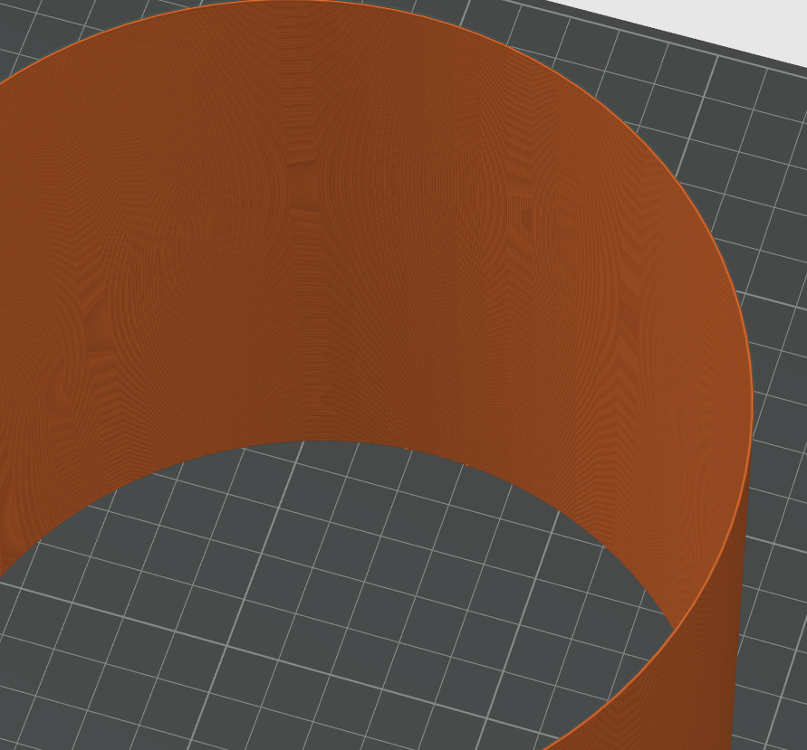

# 3D Printing Instructions

This directory contains all STL files for the GrowTower project.

## General Printing Recommendations & Materials

- **Main Material:** PETG White (highly recommended for the main body). The white color is crucial on the inside to maximize light reflection for the plant.
- **Exceptions (Black Material):** The Filter Components, Plant Pot, and Water Reservoir can and should be printed in **Black PETG** (or another dark opaque color). This prevents light from reaching the roots and water, which would otherwise encourage algae growth.
- **Light-Proofing (Crucial Step):** The white outer shell **must** be light-proofed from the outside. This is a critical physical requirement to prevent external light from disrupting the plant's light cycle (especially important for photoperiod strains in Grow #2). 
  - **Method 1 (Recommended):** Coat the fully assembled white outer shell from the outside using black spray foil / liquid rubber (e.g., PlastiDip). This ensures a light-tight seal by filling microscopic 3D printing gaps and offers better thermal elasticity.
  - **Method 2:** Wrap the outside tightly in a black, light-blocking foil or tape.
  - *Note:* The inside of the shell must remain white for maximum light reflection!
- **Nozzle:** 0.6mm recommended (faster printing, sufficient precision)
- **Support:** Generally not required for most parts

---

## Plant Pot Printing Instructions

The plant pot is 100mm tall. For optimal results without supports, the pot can either be printed **solid in one piece** or **cut at 49.7mm** and glued together:

### Option 1: Print Solid (Recommended for seamless result)
- Print the entire pot in one piece
- No cutting or gluing required
- May require minimal support for the rim

### Option 2: Cut and Glue (Saves support material)
1. **Cut the Pot:** In your slicer, use the cut tool to split the pot horizontally at **49.7mm** (exactly half).
2. **Print Both Parts:** 
   - **Upper part:** Print as oriented in the STL (no change needed)
   - **Lower part:** Rotate so the cut face sits flat on the print bed
3. **Glue Together:** After printing, glue the two halves together using super glue or epoxy. Align the seams carefully for a clean joint.

The cut method saves support material since each half prints flat without supports.

| | |
|:---:|:---:|
|  |  |
| *Plant Pot Upper* | *Plant Pot Lower* |

---

## Internal Sieve Printing Instructions

The Internal Sieve model is intentionally designed to be "closed". To print it correctly:

1.  **Open the Sieve:** In your slicer, use a modifier to remove the top and bottom solid layers.
2.  **Create the Mesh:** Set the infill density to approximately **30%** and use a **Rectilinear** pattern. This generates the necessary mesh structure for the filter.

| | |
|:---:|:---:|
|  |  |
| *Sieve View 1* | *Sieve View 2* |

---

## Reservoir 850 Vase Printing Instructions

**File:** `Reservoir 850 vase.stl`

For optimal printing results and watertightness, use these settings:

1. **Vase Mode:** Enable "Spiralize" or "Vase Mode" in your slicer.
2. **Bottom Layers:** Use at least **4 bottom layers** for a stable and leak-proof base.
3. **Pattern Design:** Ensure the upper pattern differs from the lower pattern to create a distinct transition and visual appeal.
4. **Layer Height:** Use a **small layer height** (e.g., 0.1-0.2mm) to ensure the print is watertight.
5. **Flow Rate:** Increase flow rate by at least **5%** compared to your standard settings for better layer adhesion and watertightness.
6. **Ironing:** Enable ironing to re-weld the top layer for a smoother and more sealed surface.
7. **Infill/Wall Overlap (OrcaSlicer):** Set BOTH values to **40% to 50%**:
   - `InfillWall-Overlap`
   - `infill-wall-overlap`

### Troubleshooting Leaks

- **Water Test:** Always perform a water test before using the reservoir to check for leaks.
- **Common Issue:** Pay special attention to the transition from the bottom to the walls, as this is where leaks most commonly occur.
- **Repair:** If leaks are found at the bottom-wall transition, they can often be fixed by welding the spots with a soldering iron. Don't give up - somehow it can always be made watertight!

---

## Other Parts

The remaining parts (Inner Shell, Outer Shell, Outer Shell Bottom, Shell Connector, Filter Housing, Fan Adapter) can be printed with standard settings:

- **Infill:** 15-20%
- **Supports:** Not required
- **Orientation:** Print as oriented in the STL file

### Outer Shell Assembly

The outer shell consists of **3x Outer Shell** + **1x Outer Shell Bottom**, connected with **3x Shell Connector**:

**Printing Options:**
- **Standard Print:** Print with normal settings (15-20% infill, walls as normal)
- **Vase Mode (Faster):** Print in vase/spiralize mode for faster printing. Note: You'll need to orient the LED strips carefully after printing to ensure even light distribution. When printed in vase mode, a small bump remains visible on the inside - use this as your orientation marker for LED strip alignment.

| | |
|:---:|:---:|
|  | *Visible bump for LED orientation* |

**Assembly:**
1. **Print:** Print 3x Outer Shell and 1x Outer Shell Bottom, plus 3x Shell Connector
2. **First Connector:** 
   - Apply a small amount of glue to the connector and position it on the first Outer Shell section
   - Apply glue all around the connector where it overlaps with the shell
   - Push the connector down so it slides onto the glue - this ensures the 50% overlap
3. **First Shell Section Complete:** Let the glue fully cure before continuing (otherwise it will slip)
4. **Add Second Shell:**
   - Apply a small amount of glue to the connector and pre-mount the next Outer Shell section
   - Apply glue all around the connector
   - Push the second shell down onto the connector
5. **Repeat:** Continue the same process for all remaining Outer Shell sections
6. **Attach Bottom:** Finally, attach the Outer Shell Bottom at the base using the same method

The Shell Connector is a ring that overlaps 50% with each shell, creating a secure slip-fit joint between sections.
